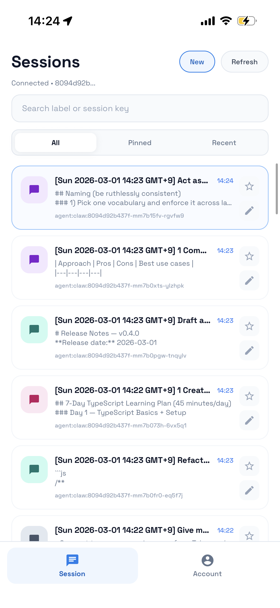
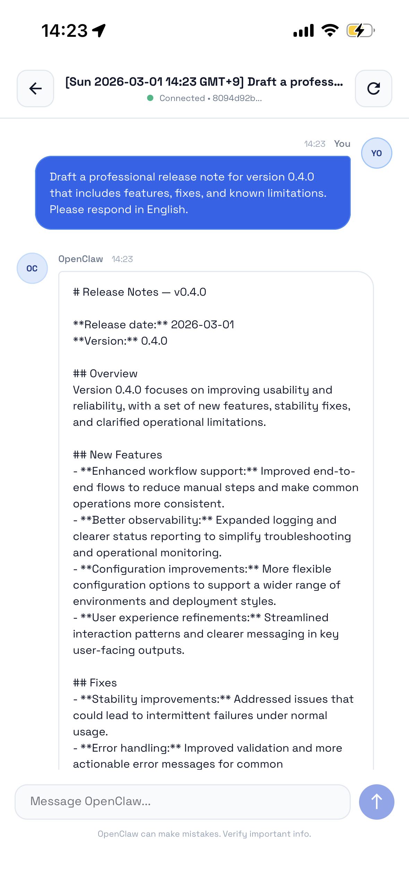

# openpocket

A mobile client for OpenClaw, designed for secure access from **Tailnet (Tailscale)-connected devices only**.

## Languages

- English: This file
- Japanese: [README.ja.md](README.ja.md)

## Overview

openpocket provides a dedicated mobile UI for operating OpenClaw without relying on chat platforms.
The app connects to OpenClaw Gateway over WebSocket and focuses on session-based workflows.

## Features

- Tailnet-only access model (Tailscale network boundary)
- Token-based connection with persisted secure credentials
- Device identity generation and challenge-response authentication
- Device token persistence after successful pairing
- Optional biometric authentication on app launch (mobile)
- Auto-login gate using stored credentials and identity
- Connection state visibility (connecting / connected / reconnecting / error)
- Session list with search, pin/unpin, and recent/pinned filtering
- Session label editing from the app UI
- Chat history loading per session
- Real-time chat streaming (`delta` / `final` / `aborted` / `error`)
- Send and abort controls for in-flight chat runs
- Automatic reconnect support in the Gateway client

## Screenshots

Current gallery (2 screenshots):

| Sessions                                  | Chat                              |
| ----------------------------------------- | --------------------------------- |
|  |  |

Planned addition:

- Add `docs/img/setup.png` later, then promote this section to a 3-panel hero (`Connect / Organize / Chat`).

## Status

- Core functionality is mostly implemented and usable.
- Ongoing work is focused on polish, stability, and UX improvements.

## Development

- Tech stack: React Native (Expo) + TypeScript
- Target backend: OpenClaw Gateway (WebSocket protocol)

## License

Proprietary (All rights reserved)
